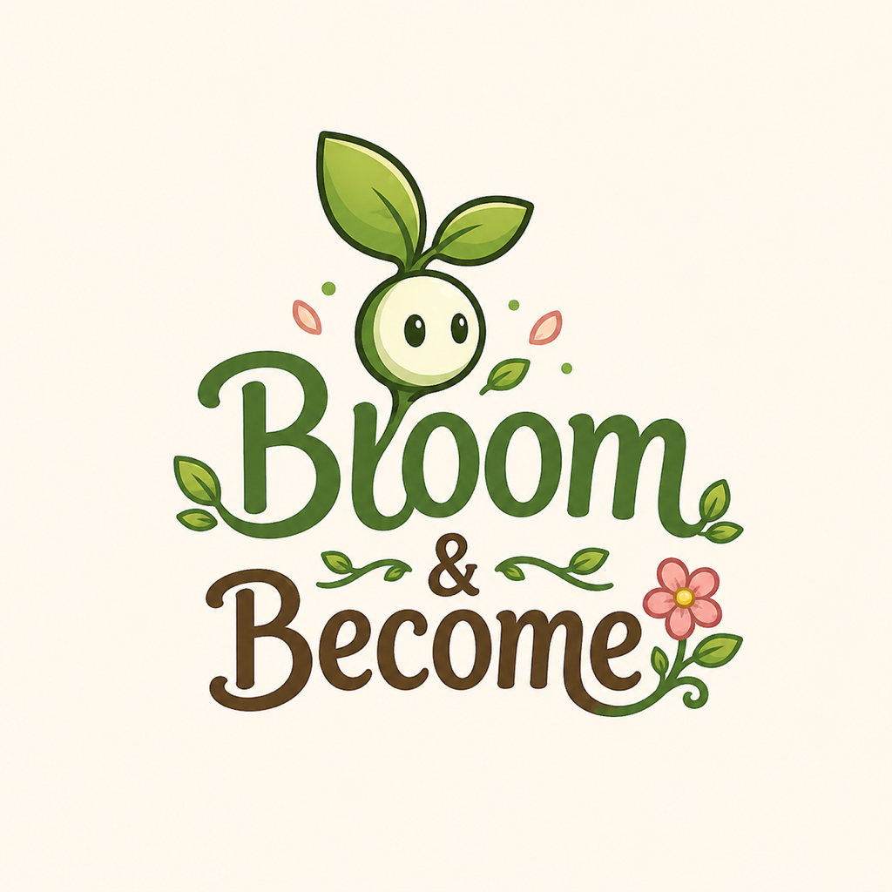

  

<h1 align="center">Bloom & Become</h1>

  <strong>A 2D spring platformer made for a 48-hour game jam with the theme Evolution.</strong>

  
  
  
  

## Controls
- Move: A/D or Arrow Keys
- Jump: Space/W/Up
- Glide: Hold Space after unlocking Bud Form
- Bloom Burst: E/X after unlocking Bloom Form
- Restart: R
- Quit: Esc

## Theme
The player evolves from a sprout into a blooming flower, unlocking new abilities with each growth stage.

## Credits
See CREDITS.md.
